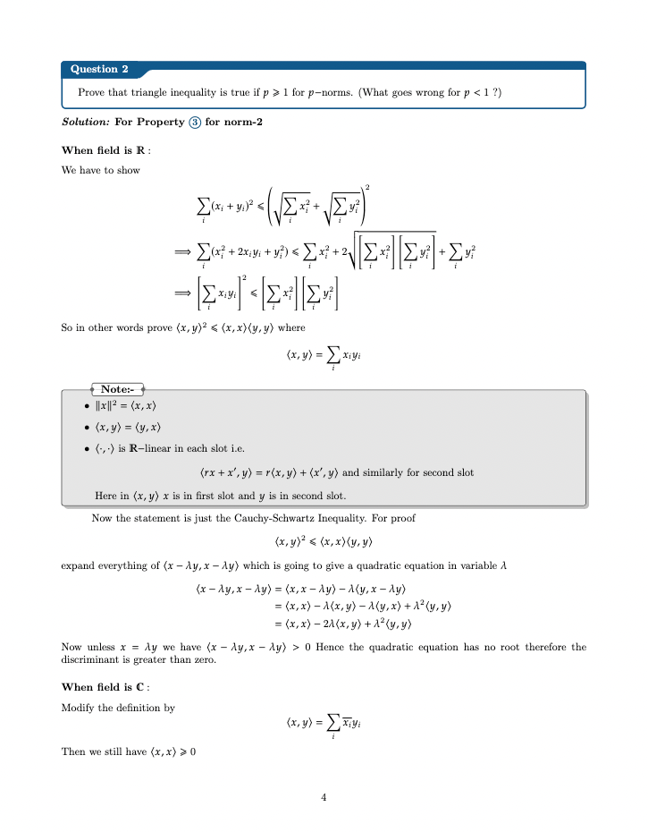

## LaTeX template for assessments + note-taking

credit: [SeniorMars](https://github.com/SeniorMars/dotfiles/tree/master/latex_template)

- `letterfonts.tex` - fonts
- `macros.tex` - commands
- `preamble.tex` - packages, definitions, commands
- `template.tex` - template with examples
- `blank-template.tex` - blank template, only inputs and title

Compress to upload to web-based environment e.g., [Overleaf](https://www.overleaf.com/project):
```bash
zip -r name.zip . -x ".git/*"
```

For local development:
Requires LaTeX distribution in system PATH e.g., [TeX Live](https://www.tug.org/texlive/), [MiKTeX](https://miktex.org/)

Screenshot of compiled template:

